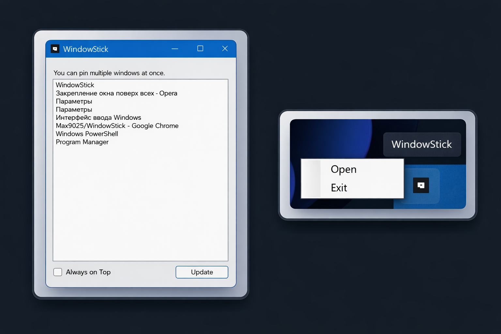

# 📌 WindowStick

**WindowStick** — это лёгкая Windows-утилита для закрепления любых окон поверх остальных (Always on Top).

Приложение работает из системного трея и позволяет управлять состоянием окон в один клик.

---

## 🚀 Возможности
- Закрепление выбранных окон поверх всех
- Управление через системный трей
- Корректный сброс TopMost при завершении
- Минималистичный интерфейс
- Не требует установки драйверов или прав администратора

---

## 🛠 Используемые технологии
- C#
- .NET Framework 4.8
- WinForms
- WinAPI (user32.dll)
- System Tray (NotifyIcon)

---

## 📦 Установка
1. Перейти в раздел **Releases**
2. Скачать установщик
3. Установить и запустить приложение

---

## 🧠 Архитектура проекта
- **UI**
  - MainForm
  - TrayController
- **Services**
  - WindowService
- **Infrastructure**
  - WinApiWrapper
- **Models**
  - WindowInfo

---

## 📷 Скриншоты

---

## 📄 Лицензия

MIT License
